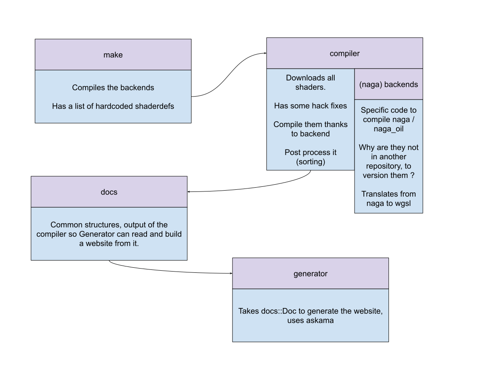

# shader docs

Shader docs allows to parse wgsl shaders exposed from crates, and display documentation about it in a webpage.

Information can contain functions, types, and shaderdefs.

## Architecture

- Supports different naga backends.
- Uses naga and naga_oil to get accurate information

## License

Licensed under either of

- Apache License, Version 2.0 ([LICENSE-APACHE](LICENSE-APACHE))
- MIT license ([LICENSE-MIT](LICENSE-MIT))

at your option.
